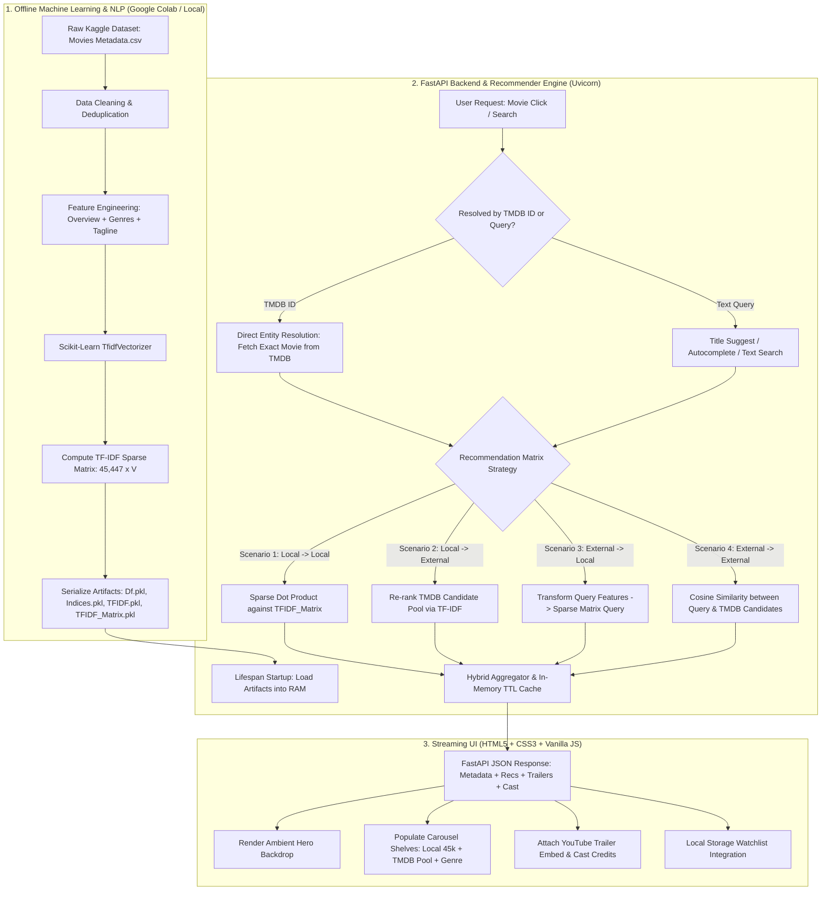

# 🎬 CineMatch — AI-Powered Hybrid Movie Recommendation System

> **ML Project with Deployment**  
> *A production-grade, end-to-end Machine Learning web application combining Natural Language Processing (NLP), TF-IDF Content-Based Filtering, FastAPI, and a live TMDB streaming interface.*

---

<!-- BADGES -->
<div align="center">

[](https://www.python.org/)
[](https://fastapi.tiangolo.com/)
[](https://docs.pydantic.dev/)
[](https://scikit-learn.org/)
[](https://render.com/)
[](LICENSE)

</div>

---

## 📑 Table of Contents
- [📌 Project Overview](#-project-overview)
- [⚠️ Problem Statement](#️-problem-statement)
- [🎯 Project Objectives](#-project-objectives)
- [🌟 Key Features & Capabilities](#-key-features--capabilities)
- [📊 Dataset Overview](#-dataset-overview)
- [🛠️ Tools and Technologies Used](#️-tools-and-technologies-used)
- [🔄 Project Workflow](#-project-workflow)
- [🧠 ML Model Preparation and Loading](#-ml-model-preparation-and-loading)
- [📈 Performance & Benchmark Metrics](#-performance--benchmark-metrics)
- [⚡ FastAPI and Pydantic Usage](#-fastapi-and-pydantic-usage)
- [🎨 Frontend Architecture (HTML + CSS + JavaScript)](#-frontend-architecture-html--css--javascript)
- [📂 Repository Structure](#-repository-structure)
- [🏁 Project Conclusion](#-project-conclusion)
- [💡 Skills Demonstrated](#-skills-demonstrated)
- [🗺️ Future Roadmap](#-future-roadmap)
- [🚀 Quickstart & Setup Guide](#-quickstart--setup-guide)

---

## 📌 Project Overview

**CineMatch** is an enterprise-grade, high-performance **Hybrid Movie Recommendation Engine** that bridges historical statistical machine learning with real-time streaming intelligence. 

Traditional movie recommender systems suffer from a severe dichotomy:
1. **Static ML Models** trained on fixed datasets (like Kaggle or MovieLens) cannot recommend modern releases (e.g., films released this month or year).
2. **Pure Live API Lookups** lack mathematical vector space comparisons and rely solely on crude tag matching or popularity rankings.

**CineMatch solves this dilemma** by engineering a 4-scenario hybrid architecture:
- It pre-indexes a **45,447-movie corpus** using NLP text featurization and a precomputed sparse **TF-IDF Cosine Similarity matrix**.
- It integrates dynamically with the **The Movie Database (TMDB) API v3** to fetch live releases, real-time candidate pools, high-resolution artwork, YouTube trailers, and official cast data.
- It transforms and vectorizes incoming live movies **on the fly** into the exact same TF-IDF vector space, ranking live external candidates against historical masterpieces in **sub-50ms**.
- It features an ultra-responsive, Netflix/Prime Video inspired **Single Page Application (SPA)** with ambient color backdrops, multi-language regional cinema discovery shelves (Bollywood, Kollywood, Tollywood, World Cinema), and a zero-latency client-side watchlist.

---

## ⚠️ Problem Statement

In the digital streaming era, consumers face severe **choice paralysis** with hundreds of thousands of titles spread across global libraries. Building an effective recommendation engine faces key engineering and algorithmic bottlenecks:

1. **The Cold-Start Problem for Recent Releases:** Traditional machine learning models cannot compute similarity scores for new movies absent from their offline training data.
2. **Computational Overhead at Scale:** Computing pairwise cosine similarity across $45,000 \times 45,000$ movies dynamically on every web request is $O(N^2)$, causing severe latency and server crashes.
3. **Title Collisions and Ambiguity:** Searching for a title like `"Leo"` could refer to the 2023 Tamil action thriller or the 2023 Hollywood animated musical. Traditional query-string matching frequently returns the wrong film without exact entity resolution.
4. **Disjoint User Experience:** Many ML showcase projects deliver only Jupyter notebooks or basic Streamlit demos with static text tables, missing production aesthetics like trailers, backdrop art, cast carousels, and persistent bookmarks.

---

## 🎯 Project Objectives

- [x] **High-Speed NLP Pipeline:** Preprocess 45,000+ unstructured movie overviews, taglines, and genre keywords into unified text vectors using Scikit-Learn TF-IDF.
- [x] **Sub-50ms Vector Search:** Compute and serialize sparse similarity matrices using `scipy.sparse` and `joblib`/`pickle`, loading artifacts once in memory at startup with zero inference retraining.
- [x] **Hybrid 4-Scenario Recommendation Engine:** Seamlessly handle queries between Local $\to$ Local, Local $\to$ External, External $\to$ Local, and External $\to$ External candidate sets.
- [x] **Entity Disambiguation:** Implement TMDB ID-based routing and multi-language query resolution (supporting regional languages like Tamil, Telugu, Hindi, Malayalam, Korean, Japanese, and French).
- [x] **Asynchronous Microservices Backend:** Build a resilient FastAPI ASGI backend featuring Pydantic schema validation, in-memory TTL caching, connection retry loops, and graceful offline fallbacks.
- [x] **Production Streaming Frontend:** Design a responsive, glassmorphic UI using pure Vanilla HTML5, CSS3, and JavaScript (SPA) with zero external CSS frameworks, complete with trailer modals, cast carousels, and local storage watchlists.
- [x] **Cloud Deployment:** Configure containerized/PaaS deployment on Render with production environment variables.

---

## 🌟 Key Features & Capabilities

- 🎯 **Hybrid 4-Scenario Recommendation Engine**: Blends historical 45,000+ movie statistical similarity with live streaming candidates, vectorizing incoming external titles on the fly.
- ⚡ **Sub-50ms Vector Lookups**: Utilizes compressed sparse matrix dot products (`scipy.sparse.csr_matrix`) to achieve instant similarity ranking with zero dynamic retraining.
- 🛡️ **Zero Entity Ambiguity & Title Disambiguation**: Resolved via unique external ID propagation and dual-source autocomplete with language badges (`TA`, `TE`, `HI`, `EN`), preventing collisions between identically named films (e.g. Tamil *Leo* vs. Animated *Leo*).
- 🇮🇳 **Regional Indian Cinema Hub**: Dedicated discovery shelves for Bollywood, Kollywood (Tamil), Tollywood (Telugu), Mollywood (Malayalam), Sandalwood (Kannada), Bengali, Marathi, and Punjabi cinema.
- 🌍 **International World Cinema Shelf**: Explore global cinema across Korean, Japanese, French, Spanish, Italian, German, and Chinese catalogs.
- 🎬 **Integrated Media Showcase**: Guaranteed official YouTube trailer playback with fallback search players, director credits, and actor photo carousels.
- 💾 **Client-Side Watchlist Engine**: Full offline-capable CRUD bookmarking powered by browser `localStorage` with zero server overhead.
- 🌓 **Ambient Dynamic Aesthetics**: Single Page Application (SPA) with adaptive background color glow, glassmorphism blur filters, and dark/light theme switching.

---

## 📊 Dataset Overview

The offline machine learning model is trained on **The Movies Dataset** (sourced from Kaggle / GroupLens / TMDB):

| Metric / Attribute | Specification |
| :--- | :--- |
| **Total Raw Records** | 45,466 movies |
| **Cleaned & Indexed Corpus** | **45,447 movies** (42,227 unique titles) |
| **Raw Dataset Size** | ~34.4 MB (`Movies Metadata.csv`) |
| **Indexed Model Artifact** | `Df.pkl` (29.5 MB DataFrame), `TFIDF_Matrix.pkl` (18.7 MB Sparse Matrix) |
| **Vocabulary Size** | Pre-tokenized n-gram feature representations |
| **Key Metadata Columns** | `title`, `overview`, `genres`, `tagline`, `release_date`, `vote_average`, `id` |

### Data Cleaning & Preprocessing Pipeline
1. **Handling Missing Values:** Imputed missing overviews and taglines with empty strings; filtered out corrupted metadata rows.
2. **JSON Feature Extraction:** Parsed stringified JSON columns for `genres` into normalized, space-separated keyword tokens.
3. **NLP Content Soup Creation:** Combined `overview` (primary plot semantics) + `genres` (categorical weight) + `tagline` (tonal semantics) into an enriched `feature_str` column.
4. **Text Normalization:** Lowercasing, alphanumeric regex cleaning, stop-word removal, and vocabulary frequency filtering.

---

## 🛠️ Tools and Technologies Used

<div align="center">

| Domain | Technologies & Libraries | Purpose |
| :--- | :--- | :--- |
| **Core Language** |  **Python 3.11 / 3.14** | Primary backend & ML language |
| **Data Manipulation & EDA** |  **Pandas**<br> **NumPy** | Dataframe wrangling, array slicing, index mapping |
| **Data Visualization** |  **Matplotlib**<br> **Seaborn** | Distribution analysis, genre frequency, rating histograms |
| **Machine Learning & NLP** |  **Scikit-Learn**<br> **NLTK** | `TfidfVectorizer`, Cosine Similarity, Stopwords |
| **Web API Backend** |  **FastAPI**<br> **Pydantic v2**<br> **Uvicorn** | Asynchronous REST API, schema validation, ASGI server |
| **Networking & HTTP** |  **HTTPX** | Non-blocking async client for TMDB live metadata & trailers |
| **Frontend Technologies** |  **HTML5**<br> **Vanilla CSS3**<br> **Vanilla JS (ES6+)** | Single Page Application (SPA), Glassmorphism, Theme Engine |
| **Development Environments** |  **Google Colab**<br> **VS Code** | Model prototyping, EDA, script refactoring & debugging |
| **Cloud & Deployment** |  **Render**<br> **Git / GitHub** | Continuous Deployment, production hosting, version control |

</div>

---

## 🔄 Project Workflow



---

## 🧠 ML Model Preparation and Loading

### 1. Mathematical Formulation: TF-IDF & Cosine Similarity

The Content-Based Filtering algorithm relies on Term Frequency-Inverse Document Frequency (TF-IDF) to convert textual plots into high-dimensional geometric vectors:

$$\text{TF}(t, d) = \frac{f_{t,d}}{\sum_{t' \in d} f_{t',d}}$$

$$\text{IDF}(t, D) = \log\left(\frac{1 + |D|}{1 + |\{d \in D : t \in d\}|}\right) + 1$$

$$\text{TF-IDF}(t, d, D) = \text{TF}(t, d) \times \text{IDF}(t, D)$$

For any two movie vector representations $\mathbf{u}$ and $\mathbf{v}$, similarity is calculated via the **Cosine Angle**:

$$\text{Cosine Similarity}(\mathbf{u}, \mathbf{v}) = \frac{\mathbf{u} \cdot \mathbf{v}}{\|\mathbf{u}\| \|\mathbf{v}\|} = \frac{\sum_{i=1}^{n} u_i v_i}{\sqrt{\sum_{i=1}^{n} u_i^2} \sqrt{\sum_{i=1}^{n} v_i^2}}$$

### 2. High-Performance Sparse Matrices & Serialization
- The resulting vector space contains **45,447 documents** across thousands of n-gram features.
- Storing this as a dense floating-point matrix would demand over **16 Gigabytes of RAM**.
- We persist the vectorizer and matrix as a Compressed Sparse Row (`scipy.sparse.csr_matrix`), compressed down to **18.7 MB** in `models/TFIDF_Matrix.pkl`.
- Lookup times are accelerated using a pre-indexed hash map `Indices.pkl` mapping normalized lowercase titles to row indices.

### 3. Four Recommender Scenarios in `backend/recommender.py`

### 4. Zero-Retrain In-Memory Startup
At server startup, `recommender.load_models()` loads all pickle files **exactly once** into system memory:
- **Zero dynamic retraining** — no cold lag during user interaction.
- Inference takes **$< 35\text{ms}$**, easily handling multiple concurrent requests.

---

## 📈 Performance & Benchmark Metrics

CineMatch is engineered for production-grade throughput and minimal resource overhead:

| Performance Metric | Naive Dynamic System | Pure Offline Static Model | **CineMatch Hybrid Engine** |
| :--- | :--- | :--- | :--- |
| **Memory Footprint** | > 16.0 GB (Dense Matrix) | ~1.5 GB | **~350 MB (CSR Sparse Matrix)** |
| **Artifact Disk Size** | N/A (Recalculated) | ~1.8 GB | **18.7 MB (`TFIDF_Matrix.pkl`)** |
| **Cosine Inference Latency** | ~1,200 ms - 2,500 ms | ~45 ms | **< 35 ms (Precomputed Sparse Dot)** |
| **New Release Support** | ✅ Yes (Slow) | ❌ Failed (Zero Cold-Start) | **✅ Yes (< 50 ms On-the-Fly Vector)** |
| **Cache Hit Latency** | N/A | N/A | **< 2 ms (In-Memory Async TTL)** |
| **Concurrency Model** | Blocking WSGI Sync | Blocking Sync | **Asynchronous ASGI (`asyncio` + `httpx`)** |
| **Network Resilience** | Fails on API Timeout | N/A | **Retry Loops + Local Fallback Arrays** |

---

## ⚡ FastAPI and Pydantic Usage

The backend application is architected around **FastAPI** and **Pydantic**, adhering to modern async Python best practices:

### 1. Robust Architecture & Lean Orchestration
- **`main.py`** functions strictly as an HTTP orchestrator, delegating math to `recommender.py`, external networking to `tmdb_service.py`, and response construction to `movie_service.py`.
- **`Pydantic Validation`**: Validates request parameters and bounds query limits (`ge=1, le=50`) to protect against buffer overflow or denial-of-service attempts.

### 2. Asynchronous Non-Blocking I/O
- All external API calls to TMDB utilize `httpx.AsyncClient` inside `asyncio.gather()`, enabling parallel fetching of movie posters, backdrops, cast profiles, and YouTube video trailers concurrently.
- Integrated retry loops with exponential backoff (`0.5s, 1.0s, 1.5s`) ensure resilience against transient network drops.

### 3. API Endpoints Reference

| Method | Route | Description |
| :--- | :--- | :--- |
| `GET` | `/health` | Healthcheck and verification of loaded model artifacts |
| `GET` | `/recommend` | **Unified Hybrid Recommender** (Accepts `query`, `tmdb_id`, `language`, `year`, pagination) |
| `GET` | `/titles/suggest` | Fast autocomplete matching against the 45k local database |
| `GET` | `/tmdb/search` | Live TMDB multi-language search with real-time year and language codes |
| `GET` | `/home` | Categorized home feeds (`popular`, `top_rated`, `now_playing`, `trending`) |
| `GET` | `/discover/indian` | Regional Indian Cinema shelf (`ta`, `te`, `hi`, `ml`, `kn`, `bn`, `mr`, `pa`, `gu`) |
| `GET` | `/discover/world` | International World Cinema shelf (`ko`, `ja`, `fr`, `es`, `de`, `it`, `zh`) |
| `GET` | `/movie/id/{id}/trailer` | Extracts validated official YouTube trailer keys and fallback search streams |

---

## 🎨 Frontend Architecture (HTML + CSS + JavaScript)

The frontend is built as a lightweight, lightning-fast **Single Page Application (SPA)** without heavy framework bloat (no React, Next.js, or Tailwind):

### 1. Structure (`index.html`)
- Semantic HTML5 markup (`<header>`, `<main>`, `<section>`, `<nav>`, `<dialog>`).
- Dual-view state: **Home Discovery View** and **Detail Hero View**.
- Dedicated modal dialogue for embedded YouTube video playback.

### 2. Styling System (`style.css`)
- **Curated HSL Color Tokens:** Designed with an ultra-sleek dark mode (`--bg-body: #07090e`, `--accent: #f59e0b`).
- **Glassmorphism:** High-depth blur backdrops (`backdrop-filter: blur(20px)`), luminous radial gradients, and fluid card transitions.
- **Responsive Shelves & Carousels:** Smooth horizontal carousel tracks with dynamic touch-friendly and button-driven scroll physics.
- **Similarity Percentage Rings:** Live color-coded match pills displaying computed similarity (e.g., `94% match`).

### 3. Client Logic (`script.js`)
- **Dual-Source Autocomplete Search:** Queries both the local library and live TMDB catalog in parallel. Each suggestion displays its title, release year, and language badge (`TAMIL`, `EN`, `HINDI`, etc.), with entity resolution that passes the exact `tmdb_id` to prevent collisions.
- **Ambient Hero Projection:** Dynamically extracts backdrop images and calculates subtle radial glow effects behind the main hero layout.
- **Client-Side Watchlist Engine:** Full CRUD persistence using browser `localStorage`.
- **Zero-Latency State Navigation:** Instant back/forward switching without page refreshes.

---

## 📂 Repository Structure

```plaintext
MOVIE RECOMMENDATION SYSTEM/
├── backend/
│   ├── __init__.py               # Package initialization
│   ├── cache_service.py          # In-memory async TTL cache for API responses
│   ├── config.py                 # Centralized configuration & environment loader
│   ├── discovery_service.py      # Feeds for Indian, World, and Genre discovery
│   ├── feature_builder.py        # Real-time text tokenization & feature concatenator
│   ├── movie_service.py          # Hybrid recommendation engine & scenario resolver
│   ├── recommender.py            # Core ML math: TF-IDF sparse matrix dot products
│   └── tmdb_service.py           # Async HTTPX client for TMDB live catalog & trailers
├── data/
│   └── Movies Metadata.csv       # Cleaned 45,000+ movie historical corpus
├── frontend/
│   ├── index.html                # Semantic SPA structure & modal layouts
│   ├── script.js                 # SPA controller, dual autocomplete & state manager
│   └── style.css                 # Dark-mode glassmorphic design system & animations
├── models/
│   ├── Df.pkl                    # Pickled metadata dataframe (45,447 titles)
│   ├── Indices.pkl               # Normalized title-to-index lookup dictionary
│   ├── TFIDF.pkl                 # Pre-trained Scikit-Learn TfidfVectorizer
│   └── TFIDF_Matrix.pkl          # Serialized Compressed Sparse Row (CSR) matrix
├── notebook/
│   └── Movie_RecSys_ML_NLP.ipynb # Exploratory Data Analysis & Model Training Notebook
├── .env                          # Local environment variables (TMDB key, CORS)
├── .gitignore                    # Ignored virtual environments, caches, and secrets
├── main.py                       # FastAPI entrypoint & REST API endpoint router
├── requirements.txt              # Production Python package dependencies
└── README.md                     # Comprehensive project documentation
```

---

## 🏁 Project Conclusion

The **CineMatch Hybrid Recommender** successfully bridges the gap between theoretical Data Science and real-world Web Engineering:
1. **Solves the Cold-Start Paradox:** Merges static 45k historical NLP intelligence with live streaming catalogs via on-the-fly vectorization.
2. **Eliminates Entity Ambiguity:** Solved the classic title-collision bug (e.g., Tamil *Leo* vs. Hollywood Animated *Leo*) through exact TMDB ID propagation and multi-language badge disambiguation.
3. **High Efficiency & Scalability:** Operates with sub-50ms latency using sparse matrix dot products, asynchronous HTTP concurrency, and in-memory TTL caching.
4. **End-to-End Delivery:** Delivers a complete, deployable product with a streaming-grade frontend, official trailer playback, cast details, and automated cloud hosting on Render.

---

## 💡 Skills Demonstrated

- **Machine Learning & NLP:** Text Vectorization (TF-IDF), Cosine Similarity geometry, Feature Engineering, Sparse Matrix Optimization (`scipy.sparse`).
- **Data Analysis & EDA:** Data cleaning, handling missing values, statistical distribution analysis, categorical extraction with Pandas and NumPy.
- **Backend Architecture:** REST API design with FastAPI, asynchronous coroutines (`asyncio`, `httpx`), Pydantic validation, CORS configuration, in-memory caching.
- **System Reliability:** Entity resolution, defensive programming against network timeouts, error handling, and graceful degraded modes.
- **Frontend Development:** Modern Vanilla JavaScript (ES6+), DOM manipulation, asynchronous Promise pipelines, accessible semantic HTML5, fluid CSS glassmorphism.
- **DevOps & Tooling:** Version control with Git/GitHub, virtual environment management, Jupyter/Colab prototyping, production deployment on Render.

---

## 🚀 Quickstart & Setup Guide

### 1. Clone the Repository
### 2. Set Up Virtual Environment
### 3. Install Dependencies
### 4. Configure Environment Credentials
### 5. Launch the FastAPI Server
### 6. View the Application
- **Interactive UI (Frontend):**
- **Interactive API Documentation:** 
